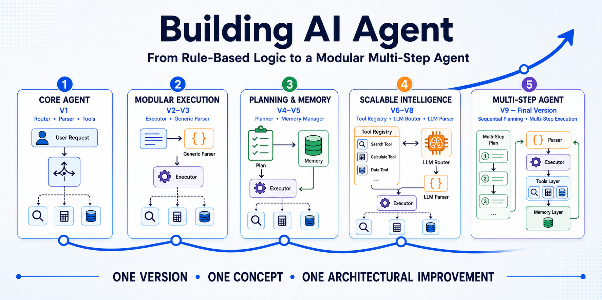

# Building AI Agent


[](https://www.kaggle.com/code/lucalullo/building-ai-agent)
[](LICENSE)


A progressive educational project that shows how to build an AI agent step by step, from scratch, using pure Python.

The current version completes the original roadmap with multi-step execution. A small local pretrained language model is used for both semantic tool routing and argument parsing, without using an external inference API or an agent framework. Each version introduces one new architectural concept, making routing, planning, parsing, tool execution and memory easier to understand step by step.

## Project roadmap

The complete project evolves through five main stages:

1. core agent;
2. modular execution;
3. planning and managed memory;
4. scalable intelligence with a Tool Registry and LLM integration;
5. multi-step execution.

Each stage introduces one architectural improvement while preserving the concepts developed in the previous versions.



## Online notebook

An executable version of the project is available on Kaggle:

### [Open Building AI Agent on Kaggle](https://www.kaggle.com/code/lucalullo/building-ai-agent)

## Current capabilities

The current agent can:

- receive a natural-language request;
- identify the user's intent semantically;
- select the most appropriate tool through a local LLM Router;
- create a simple execution plan;
- create multiple sequential steps for requests connected by `then`;
- explain why each selected tool should be used;
- determine which arguments are required;
- extract arguments through a local LLM Parser;
- understand numeric arguments expressed as words;
- validate the extracted arguments;
- execute the selected tools;
- pass the result of one step to the next when the request refers to `the result`;
- handle unsupported requests safely;
- manage memory through dedicated functions;
- centralize tool functions and metadata through a Tool Registry;
- store the complete request, plan, execution steps and final result in memory.

The included tools support greetings and basic arithmetic operations:

- addition;
- subtraction;
- multiplication;
- division;
- exponentiation.

## Current architecture

```text
User Request
      ↓
   Planner
      ↓
Step 1 (LLM Router → LLM Parser → Executor)
      ↓
Step 2 (LLM Router → LLM Parser → Executor)
      ↓
     ...
      ↓
Memory Manager
      ↓
    Memory
      ↓
    Output
```

The Planner can split a sequential request into multiple steps and uses the LLM Router to select the most appropriate tool for each step.

The LLM Router uses a small local pretrained language model to select tools semantically from the names and descriptions stored in the Tool Registry.

The LLM Parser uses the same local language model to extract the arguments required by the selected tool and returns them as structured JSON.

The Agent executes the plan one step at a time. When a later step refers to `the result`, the previous step result is inserted into that request before parsing and execution.

The Memory Manager saves, reads and clears memory through dedicated functions.

The Tool Registry remains the central source of tool functions and metadata for the LLM Router, Planner, LLM Parser and Executor.

Example multi-step plan:

```python
[
    {
        "request": "Add 2 and 3",
        "tool": "addition",
        "reason": "Add two numbers.",
        "needs_arguments": ["a", "b"]
    },
    {
        "request": "multiply the result by 4",
        "tool": "multiplication",
        "reason": "Multiply two numbers.",
        "needs_arguments": ["a", "b"]
    }
]
```

## Project versions

| Version | Main concept | Status | Folder |
|---|---|---|---|
| Version 1 | Agent Base | Completed | [`v01-agent-base`](v01-agent-base/) |
| Version 2 | Dedicated Executor | Completed | [`v02-executor`](v02-executor/) |
| Version 3 | Generic Parser | Completed | [`v03-generic-parser`](v03-generic-parser/) |
| Version 4 | Planner | Completed | [`v04-planner`](v04-planner/) |
| Version 5 | Memory Manager | Completed | [`v05-memory-manager`](v05-memory-manager/) |
| Version 6 | Tool Registry | Completed | [`v06-tool-registry`](v06-tool-registry/) |
| Version 7 | LLM Router | Completed | [`v07-llm-router`](v07-llm-router/) |
| Version 8 | LLM Parser | Completed | [`v08-llm-parser`](v08-llm-parser/) |
| Version 9 | Multi-Step Agent | Completed | [`v09-multi-step-agent`](v09-multi-step-agent/) |

## Version 1 - Agent Base

The first version introduces the complete basic agent flow:

```text
User Request
      ↓
    Router
      ↓
    Parser
      ↓
Tool Execution
      ↓
    Memory
```

In this version, the Agent directly coordinates the components and executes the selected tool.

Open the folder:

[`v01-agent-base`](v01-agent-base/)

## Version 2 - Executor

The second version introduces a dedicated Executor component:

```text
User Request
      ↓
    Router
      ↓
    Parser
      ↓
   Executor
      ↓
    Memory
```

Tool validation and execution are separated from the Agent, improving the separation of responsibilities.

Open the folder:

[`v02-executor`](v02-executor/)

## Version 3 - Generic Parser

The third version introduces a generic parsing mechanism based on the parameters required by each tool.

This reduces tool-specific conditions inside the Parser and prepares the architecture for:

- new tools;
- reusable parameter extractors;
- more flexible parsing;
- future LLM integration.

Open the folder:

[`v03-generic-parser`](v03-generic-parser/)

## Version 4 - Planner

The fourth version introduces a dedicated Planner component.

The agent no longer moves directly from tool selection to parsing and execution. It first creates a simple execution plan describing:

- the selected tool;
- the reason for selecting it;
- the arguments required by the tool.

The complete flow becomes:

```text
User Request
      ↓
    Router
      ↓
   Planner
      ↓
Generic Parser
      ↓
   Executor
      ↓
    Memory
      ↓
    Output
```

The Planner is still rule-based and uses the existing Router to identify the most appropriate tool.

If no suitable tool is available, the Planner creates a plan with no selected tool:

```python
{
    "tool": None,
    "reason": "No suitable tool was found for the request.",
    "needs_arguments": []
}
```

The Agent then returns a safe fallback response:

```text
I cannot handle this request yet.
```

The agent state now also includes the execution plan:

```python
{
    "request": "What is 2 + 3?",
    "plan": {
        "tool": "addition",
        "reason": "Add two numbers.",
        "needs_arguments": ["a", "b"]
    },
    "action": "addition",
    "arguments": {
        "a": 2,
        "b": 3
    },
    "result": 5
}
```

This makes the internal behavior of the agent more transparent and prepares the architecture for more advanced planning and multi-step execution.

Open the folder:

[`v04-planner`](v04-planner/)

## Version 5 - Memory Manager

The fifth version introduces a dedicated Memory Manager component.

The Agent no longer writes directly to the memory list. Instead, it delegates memory operations to dedicated functions:

- `save_to_memory(state)`;
- `get_memory()`;
- `get_last_interaction()`;
- `clear_memory()`.

The complete flow becomes:

```text
User Request
      ↓
    Router
      ↓
   Planner
      ↓
Generic Parser
      ↓
   Executor
      ↓
Memory Manager
      ↓
    Memory
      ↓
    Output
```

The Memory Manager is still simple and uses a Python list, but memory operations are now separated from the Agent coordination logic.

Open the folder:

[`v05-memory-manager`](v05-memory-manager/)

## Version 6 - Tool Registry

The sixth version introduces a centralized Tool Registry.

Tool functions and their metadata are no longer distributed across separate structures. Each tool is registered together with:

- the tool function;
- the required parameters;
- a short description;
- the synonyms used by the rule-based Router.

The Tool Registry acts as a shared source of information for the existing components:

- the Router reads registered synonyms;
- the Planner reads tool descriptions and required parameters;
- the Generic Parser reads the parameters required by the selected tool;
- the Executor retrieves and executes the registered function.

The main execution flow remains unchanged:

```text
User Request
     ↓
    Router
     ↓
   Planner
     ↓
Generic Parser
     ↓
   Executor
     ↓
Memory Manager
     ↓
    Memory
     ↓
    Output
```

The Tool Registry is not an additional execution step. It supports the Router, Planner, Generic Parser and Executor by centralizing tool definitions and metadata.

This version is still fully rule-based and does not use an LLM.

Open the folder:

[`v06-tool-registry`](v06-tool-registry/)

## Version 7 - LLM Router

The seventh version introduces the first language-model-based component: the LLM Router.

The Router no longer selects tools by scoring manually registered synonyms. Instead, it uses a small pretrained language model running locally inside the notebook:

```python
MODEL_NAME = "Qwen/Qwen2.5-0.5B-Instruct"
```

The Tool Registry remains the shared source of tool information. For routing, the LLM receives:

- the user's request;
- the registered tool names;
- the registered tool descriptions.

The model must return the name of the most appropriate tool, or `none` when no registered tool can handle the request.

The main execution flow becomes:

```text
User Request
      ↓
 LLM Router
      ↓
   Planner
      ↓
Generic Parser
      ↓
   Executor
      ↓
Memory Manager
      ↓
    Memory
      ↓
    Output
```

Only the Router uses an LLM in this version.

The Planner remains rule-based, the Generic Parser still extracts arguments with explicit rules, and the Executor, Memory Manager and Agent keep the same responsibilities as before.

The registered synonyms remain stored in the Tool Registry for continuity with Version 6, but they are no longer used by the Router to make the routing decision.

A semantic routing test such as:

```python
agent("Could you calculate the product of 2 and 3?")
```

selects `multiplication` even though `product` is not one of the registered routing synonyms. Unsupported requests such as a weather query correctly return no tool.

The model runs locally after being downloaded from Hugging Face, so Version 7 does not use an external inference API.

Open the folder:

[`v07-llm-router`](v07-llm-router/)

## Version 8 - LLM Parser

The eighth version introduces the LLM Parser.

The Router continues to use the local pretrained language model introduced in Version 7 to select the most appropriate tool.

The Parser now uses the same model to understand the user's request and extract the arguments required by the selected tool. The Tool Registry provides the selected tool description and required parameters.

The main execution flow becomes:

```text
User Request
      ↓
 LLM Router
      ↓
   Planner
      ↓
 LLM Parser
      ↓
   Executor
      ↓
Memory Manager
      ↓
    Memory
      ↓
    Output
```

The LLM Parser returns structured arguments as JSON and can handle inputs that are difficult for fixed extraction rules, including numbers expressed as words.

For example:

```python
agent("Multiply three by four.")
```

extracts the required numeric arguments and returns `12`.

The Planner remains rule-based, while the Executor, Memory Manager and Agent keep the same responsibilities as before.

Open the folder:

[`v08-llm-parser`](v08-llm-parser/)

## Version 9 - Multi-Step Agent

The ninth version introduces multi-step execution and completes the original project roadmap.

The Planner can now split a sequential request into multiple steps. Each step is routed independently, and the Agent executes the resulting plan one step at a time.

A request such as:

```python
agent("Add 2 and 3, then multiply the result by 4.")
```

creates two steps. The first step returns `5`; the Agent then resolves `the result` as `5` in the second step and returns the final result `20`.

The main execution flow becomes:

```text
User Request
      ↓
   Planner
      ↓
Step 1 (LLM Router → LLM Parser → Executor)
      ↓
Step 2 (LLM Router → LLM Parser → Executor)
      ↓
     ...
      ↓
Memory Manager
      ↓
    Memory
      ↓
    Output
```

The LLM Router and LLM Parser continue to use the same local pretrained language model. The Executor and Memory Manager remain unchanged.

The complete interaction state now stores the original request, the multi-step plan, the state of each executed step and the final result.

Open the folder:

[`v09-multi-step-agent`](v09-multi-step-agent/)

## Component responsibilities

| Component | Responsibility |
|---|---|
| LLM Router | Selects the most appropriate tool semantically using the local language model |
| Planner | Creates a single-step or multi-step execution plan |
| LLM Parser | Extracts the required arguments using the same local language model |
| Executor | Validates the arguments and executes the selected tool |
| Memory Manager | Saves, reads and clears memory |
| Tool Registry | Stores tool functions and metadata in one central structure |
| Memory | Stores the complete interaction state, including executed steps |
| Agent | Coordinates and executes the complete workflow step by step |

## Documentation

The repository includes a complete general report in Italian and English:

- [Project report - English](project-report-en.pdf)
- [Relazione del progetto - Italiano](project-report-it.pdf)

Each completed version folder contains:

- a Jupyter Notebook;
- an Italian technical report;
- an English technical report;
- a version-specific architecture diagram.

The repository also includes a general project roadmap infographic:

- [Building AI Agent roadmap infographic](infographic.png)

## Repository structure

```text
building-ai-agent/
├── v01-agent-base/
│   ├── building-ai-agent.ipynb
│   ├── Relazione Versione 1 - Agent Base.pdf
│   ├── Report Version 1 - Agent Base.pdf
│   └── Version 1.png
│
├── v02-executor/
│   ├── building-ai-agent.ipynb
│   ├── Relazione Versione 2 - Executor.pdf
│   ├── Report Version 2 - Executor.pdf
│   └── Version 2.png
│
├── v03-generic-parser/
│   ├── building-ai-agent.ipynb
│   ├── Relazione Versione 3 - Generic Parser.pdf
│   ├── Report Version 3 - Generic Parser.pdf
│   └── Version 3.png
│
├── v04-planner/
│   ├── building-ai-agent.ipynb
│   ├── Relazione Versione 4 - Planner.pdf
│   ├── Report Version 4 - Planner.pdf
│   └── Version 4.png
│
├── v05-memory-manager/
│   ├── building-ai-agent.ipynb
│   ├── Relazione Versione 5 - Memory Manager.pdf
│   ├── Report Version 5 - Memory Manager.pdf
│   └── Version 5.png
│
├── v06-tool-registry/
│   ├── building-ai-agent.ipynb
│   ├── Relazione Versione 6 - Tool Registry.pdf
│   ├── Report Version 6 - Tool Registry.pdf
│   └── Version 6.png
│
├── v07-llm-router/
│   ├── building-ai-agent.ipynb
│   ├── Relazione Versione 7 - LLM Router.pdf
│   ├── Report Version 7 - LLM Router.pdf
│   └── Version 7.png
│
├── v08-llm-parser/
│   ├── building-ai-agent.ipynb
│   ├── Relazione Versione 8 - LLM Parser.pdf
│   ├── Report Version 8 - LLM Parser.pdf
│   └── Version 8.png
│
├── v09-multi-step-agent/
│   ├── building-ai-agent.ipynb
│   ├── Relazione Versione 9 - Multi-Step Agent.pdf
│   ├── Report Version 9 - Multi-Step Agent.pdf
│   └── Version 9.png
│
├── infographic.png
├── project-report-en.pdf
├── project-report-it.pdf
├── README.md
├── LICENSE
└── .gitignore
```

## Run locally

### Requirements

- Python 3
- Jupyter Notebook or JupyterLab
- PyTorch
- Transformers
- Hugging Face Hub

No external agent framework is required. Versions 7, 8 and 9 download the pretrained language model from Hugging Face and run inference locally inside the notebook.

Clone the repository:

```bash
git clone https://github.com/lucalullo/building-ai-agent.git
cd building-ai-agent
```

Start Jupyter Notebook:

```bash
jupyter notebook
```

Then open the notebook contained in the version folder you want to study and run the cells in order.

For example, to study the final multi-step architecture:

```text
v09-multi-step-agent/building-ai-agent.ipynb
```

## Development approach

The project follows one main principle:

> **One version, one concept, one architectural improvement.**

Instead of immediately creating a complex system, the architecture evolves through small and understandable steps.

Each completed version remains available as an independent learning resource.

## Roadmap

- [x] Agent Base
- [x] Dedicated Executor
- [x] Generic Parser
- [x] Planner
- [x] Memory Manager
- [x] Tool Registry
- [x] LLM Router
- [x] LLM Parser
- [x] Multi-Step Agent

Version 9 completes the original roadmap.

## Current limitations

The final version is intentionally compact and educational:

- the LLM Router and LLM Parser use a small local model and can still make routing or parsing mistakes;
- the Planner remains rule-based and splits sequential requests through the explicit `then` pattern;
- passing a previous result to a later step relies on the phrase `the result`;
- memory is still a simple Python list managed by the Memory Manager;
- the Tool Registry is still an in-memory Python dictionary and tool registration is manual;
- multi-step execution is sequential rather than a general-purpose reasoning or workflow engine.

These are intentional scope choices rather than unfinished roadmap items.

## Project status

Version 9 therefore closes the original roadmap rather than opening another required development phase.

The project can remain finished in this form. Documentation, compatibility fixes or small maintenance updates may still be made when useful.

At the same time, the repository is intentionally not declared permanently frozen. If a future concept is worth studying with the same **one version, one concept, one architectural improvement** philosophy, Building AI Agent may one day receive additional versions beyond Version 9.

There is currently no required Version 10: any future continuation would be a new extension of an already completed project.

## License

This project is distributed under the [MIT License](LICENSE).

## Author

Created by [Luca Lullo](https://github.com/lucalullo).
